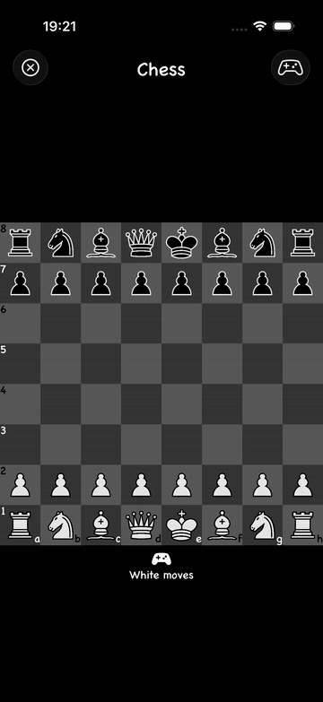

<div align="center">

# Swift Games

### Classic board games, built twice to explore modern iOS engineering

A native iOS playground that implements the same product with **SwiftUI** and **UIKit**—from reusable game logic and responsive interfaces to automated tests and localization.

[](https://swift.org)
[](https://developer.apple.com/ios/)
[](#two-approaches-one-codebase)
[](LICENSE)



</div>

## Why this project

Swift Games is more than a collection of board games. It is a hands-on comparison of Apple's two UI frameworks, with separate app targets that solve the same product and domain problems using declarative and imperative approaches.

The project highlights:

- **Game-domain modeling** with boards, pieces, positions, move validation, collision checks, turns, and chess castling
- **SwiftUI architecture** using composable views, state-driven rendering, adaptive grids, custom controls, and environment-aware layouts
- **UIKit architecture** using view controllers, collection views, reusable cells, custom views, Auto Layout, and delegation
- **Responsive design** that reacts to device orientation and supports light and dark appearances
- **Quality engineering** with XCTest unit suites, UI test targets, and dedicated test plans
- **Product polish** through String Catalog localization, settings, confirmation dialogs, onboarding, and custom assets

## App tour

<div align="center">
  
  
  
  
</div>

## Two approaches, one codebase

| | SwiftUI app | UIKit app |
|---|---|---|
| Entry point | `SwiftUIGamesApp` | `AppDelegate` + `SceneDelegate` |
| Navigation | State-driven view composition | View-controller presentation |
| Board UI | Declarative grids and reusable views | Custom views and collection views |
| Adaptivity | Dynamic stacks, grids, and orientation detection | Auto Layout and view lifecycle |
| Deployment target | iOS 15+ | iOS 13+ |
| Tests | Unit tests + UI tests + test plan | Unit tests + UI tests + test plan |

Keeping both implementations side by side makes the architectural trade-offs concrete and demonstrates fluency across legacy and modern iOS codebases.

## Games

- **Chess** — an interactive board with legal piece movement, collision rules, turn handling, castling, board rotation, and configurable themes
- **Sliding puzzle** — a SwiftUI grid with movable tiles and responsive layout behavior
- **Checkers** — a board implementation included in the SwiftUI game collection

## Project structure

```text
swift-games/
├── SwiftUIGames/                 # Modern declarative implementation
│   ├── SwiftUIGames/
│   │   ├── Chess/                # Chess domain and SwiftUI board
│   │   ├── Sliding/              # Sliding-puzzle domain and UI
│   │   ├── Checkers/             # Checkers board
│   │   └── Main/                 # Navigation and adaptive components
│   ├── SwiftUIGamesTests/        # Unit tests
│   └── SwiftUIGamesUITests/      # End-to-end UI tests
├── SwiftGames/                   # UIKit implementation
│   ├── SwiftGames/
│   │   ├── Chess/                # Models, views, and controller
│   │   └── Main/                 # Game browser and reusable cells
│   ├── SwiftGamesTests/          # Unit tests
│   └── SwiftGamesUITests/        # End-to-end UI tests
└── media/                        # Screenshots, recording, and demo GIF
```

## Getting started

### Requirements

- macOS with Xcode
- iOS 15+ simulator for the SwiftUI app
- iOS 13+ simulator for the UIKit app

### Run the SwiftUI version

1. Open `SwiftUIGames/SwiftUIGames.xcodeproj` in Xcode.
2. Select the **SwiftUIGames** scheme and an iPhone simulator.
3. Press **⌘R**.

### Run the UIKit version

1. Open `SwiftGames/SwiftGames.xcodeproj` in Xcode.
2. Select the **SwiftGames** scheme and an iPhone simulator.
3. Press **⌘R**.

Run either test suite with **⌘U**, or select its `.xctestplan` for the configured test run.

## Skills demonstrated

`Swift` · `SwiftUI` · `UIKit` · `XCTest` · `MV* architecture` · `State management` · `Auto Layout` · `Adaptive UI` · `Dark mode` · `Localization` · `Asset catalogs` · `Git`

## Roadmap

- Complete game rules and win-state handling for Checkers and Sliding Puzzle
- Add accessibility identifiers, VoiceOver descriptions, and Dynamic Type coverage
- Extract shared game-domain logic into a Swift Package
- Add CI for builds and automated tests

## Credits

Chess pieces and board-square artwork are provided by the OpenGameArt community. See the [original asset collection](https://opengameart.org/content/chess-pieces-and-board-squares).

## License

Released under the [MIT License](LICENSE).

<div align="center">
  <sub>Designed and developed as an exploration of native iOS engineering.</sub>
</div>
